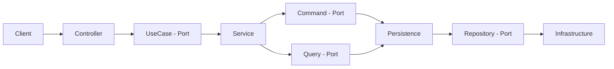

# Hexagonal Architecture Example with Spring boot

## Description

This is a simple example of Hexagonal Architecture with Spring boot.

## Spec

- Java 17
- Spring boot 3.1.5
- Gradle 7.2
- Spring Data JPA
- Querydsl
- H2 Database

## Structure



## Run

```shell
$ ./gradlew bootRun
```